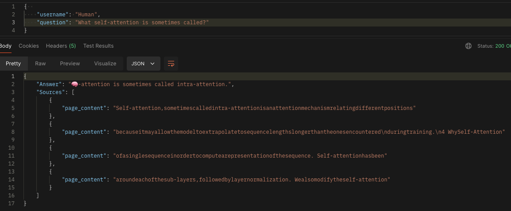
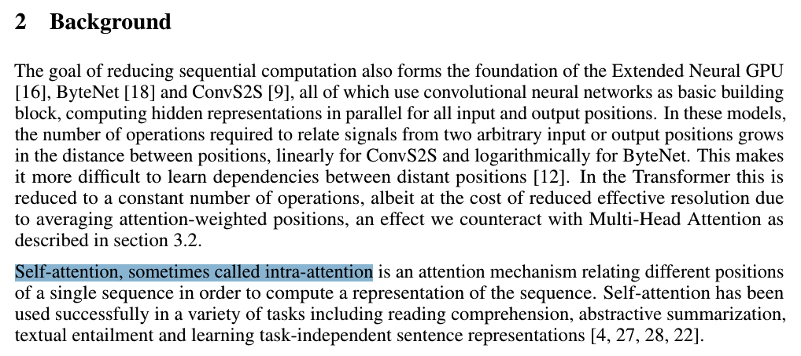
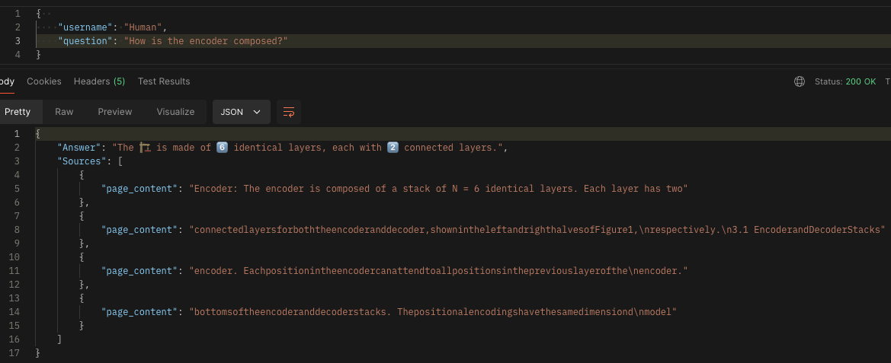
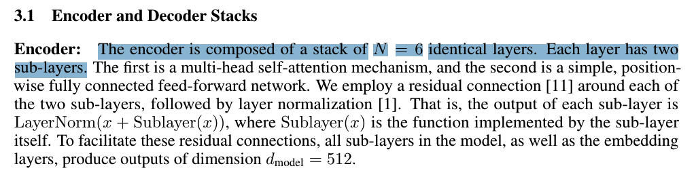
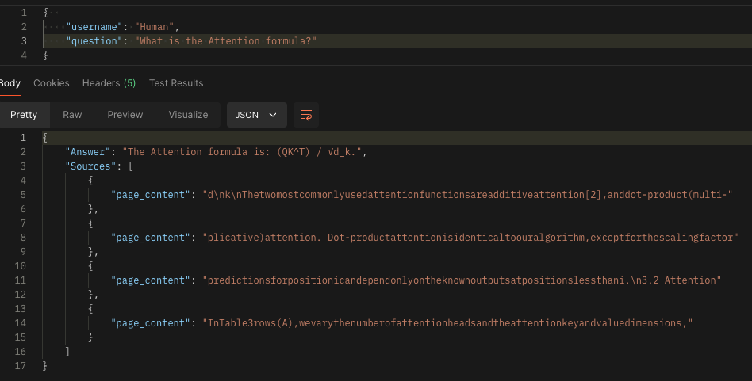
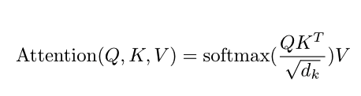
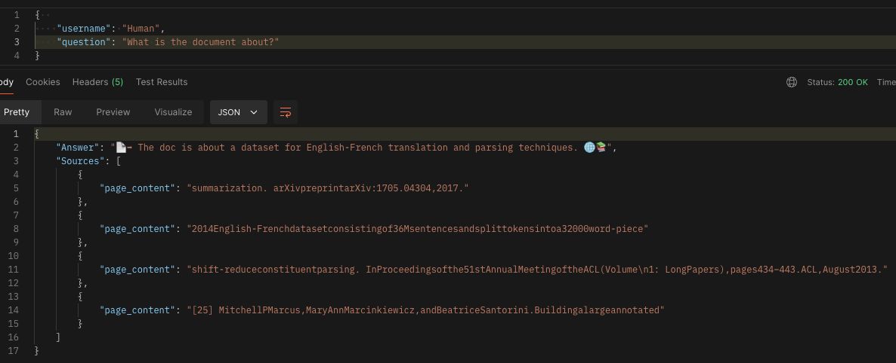
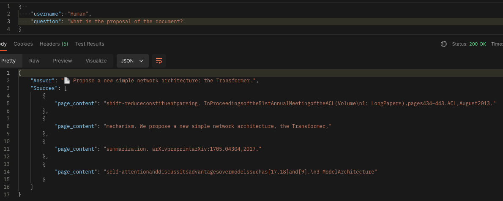
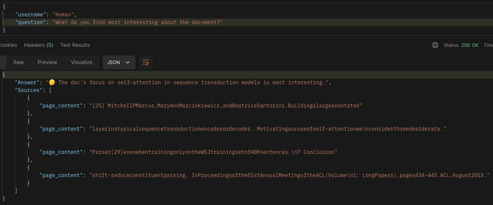

[back](/README.md#foo)

## Contents
[RAG Model Testing](#rag-model-testing-robothammer_and_wrench)<br>
- [Overview](#mag-overview)<br>
- [Step-by-Step Testing Guide](#hammer_and_wrench-step-by-step-testing-guide)<br>
  - [Step 1: Prepare the Environment](#step-1-prepare-the-environment-globe_with_meridians)<br>
  - [Step 2: Ingest the Document](#step-2-ingest-the-document-page_facing_up)<br>
  - [Step 3: Send a Prompt](#step-3-send-a-prompt-outbox_tray)<br>
  - [Step 4: Update the Variable](#step-4-update-the-variable-arrows_counterclockwise)<br>
  - [Step 5: Support](#step-5-support-sos)<br>
- [Tests Conducted](#white_check_mark-tests-conducted)<br>
- [Conclusion](#checkered_flag-conclusion)<br>


# RAG Model Testing :robot::hammer_and_wrench:

## :mag: Overview

This guide facilitates testing the RAG Model Application, demonstrating its capability to retrieve model responses from ingested documents.

### Endpoints included in this project:

- **POST /data_ingestion:** Uploads a document.
- **POST /rag_model:** Submits a prompt and retrieves a response.
    

## :hammer_and_wrench: Step-by-Step Testing Guide

### Step 1: Prepare the Environment :globe_with_meridians:

The following directories will store the source documents (`/files`) and the Chroma vector database (`/db`).

``` bash
mkdir files
mkdir db
```

### Step 2: Ingest the Document :page_facing_up:

Upload the document that the RAG Model will process and use to generate responses:

- **Endpoint:** `POST http://localhost:8080/data_ingestion`
- **Content-Type:** `multipart/form-data`
- **Body:**
    
``` json
{
    "file": "atention_is_all_you_need.pdf"
}
```
> [!NOTE]
> Replace this with you file path.

### Step 3: Send a Prompt :outbox_tray:

Send a prompt to the RAG Model and get the response based on the ingested document.

- **Endpoint:** `POST http://localhost:8080/rag_model`
- **Content-Type:** `application/json`
- **Body:**
    
``` json
{  
    "username": "Human",
    "question": "What self-attention is sometimes called"
}

 ```
> [!NOTE]
> Submit one query at a time based on the ingested document.

### Step 4: Update the Variable :arrows_counterclockwise:

Update the base_url variable if your application is hosted on a different server or port.

### Step 5: Support :sos:

For assistance, feel free to open an issue or contact [author](https://github.com/jairzinhosantos).

## :white_check_mark: Tests Conducted
The following tests were carried out based on the popular paper Attention is all you need.

1. `Question: What self-attention is sometimes called?`
<p align='center' alt='image | question-1'>
    </a>
    <sub>Figure 1</sub><br>
</p>
<p align='center' alt='image | answer-question-1'>
    </a><br>
    <sub>Figure 2</sub>
</p>

2. `Question: How is the encoder composed?`
<p align='center' alt='image | question-2'>
    </a><br>
    <sub>Figure 3</sub>
</p>
<p align='center' alt='image | answer-question-2'>
    </a><br>
    <sub>Figure 4</sub>
</p>

3. `Question: What is the Attention formula?`
<p align='center' alt='image | question-3'>
    </a><br>
    <sub>Figure 5</sub>
</p>
<p align='center' alt='image | answer-question-3'>
    </a><br>
    <sub>Figure 6</sub>
</p>

4. `Question: What is the document about?`
<p align='center' alt='image | question-4'>
    </a><br>
    <sub>Figure 7</sub>
</p>

5. `Question: What is the proposal of the document?`
<p align='center' alt='image | question-5'>
    </a><br>
    <sub>Figure 8</sub>
</p>

6. `Question: What do you find most interesting about the document?`
<p align='center' alt='image | question-6'>
    </a><br>
    <sub>Figure 9</sub>
</p>


## :checkered_flag: Conclusion

